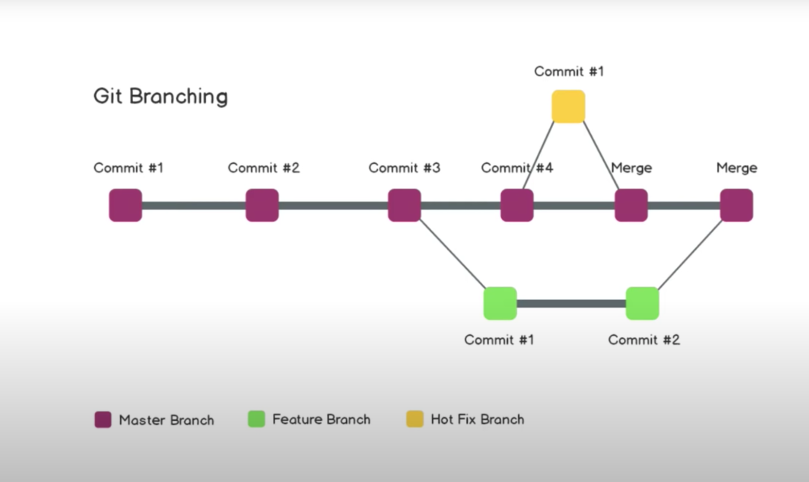

# Git

## What is Git?

- A Free and open source version control system.

## What is version control?

- A way to track our code changes
- The management of changes to documents, computer programs, large websites, and other collections of information.

## Terms

- Directory -> **Folder**
- Terminal or Command Line -> **Interface for Text Commands**
- CLI -> **Command Line Interface**
- cd -> **Change Directory**
- Coder Editor -> **Word Processor for Writing Code**
- Repository -> **Project, or the folder/place where your project is kept**
- Github -> **A website to host your repositories online**

## Git Commands

- clone -> **Bring a repository that is hosted somewhere like Github into a folder on your local machine**
- add -> **Track your files and changes in Git**
- commit -> **Save your files in Git**
- push -> **Upload Git commits to a remote repo, like Github**
- pull -> **Download changes from remote repo to your local machine, the opposite of push**
- init -> **initialize a local folder to become a git repository**
- remote add -> **link a local repo to the git repo remotely**
- remote -v -> **list remote repo from git**
- git branch-> **list all the branches and show current branch with \***
- git checkout -b "name_of_the_branch" -> **create a feature/hot branche and switch to it**
- git checkout "name_of_the_branch" -> **switch to the branch**
- git merge -> **merge different branches**
- git diff "name_of_the_branch" -> **show differences between branches**

## Github Workflow

- Write Code -> Commit Changes -> Make a Pull Request

## Local Git Workflow

- Write Code -> Stage Changes (git add) -> Commit Changes (git commit) -> Push Changes (git push) -> Make a Pull Request

## Git Branching

## Reference

- Very thanks Gwen for sharing all the Git commands and usages on youtube
- Don't forget to check out [Git and Github for Begineers - Crash Course](https://www.youtube.com/watch?v=RGOj5yH7evk&t=370s)
